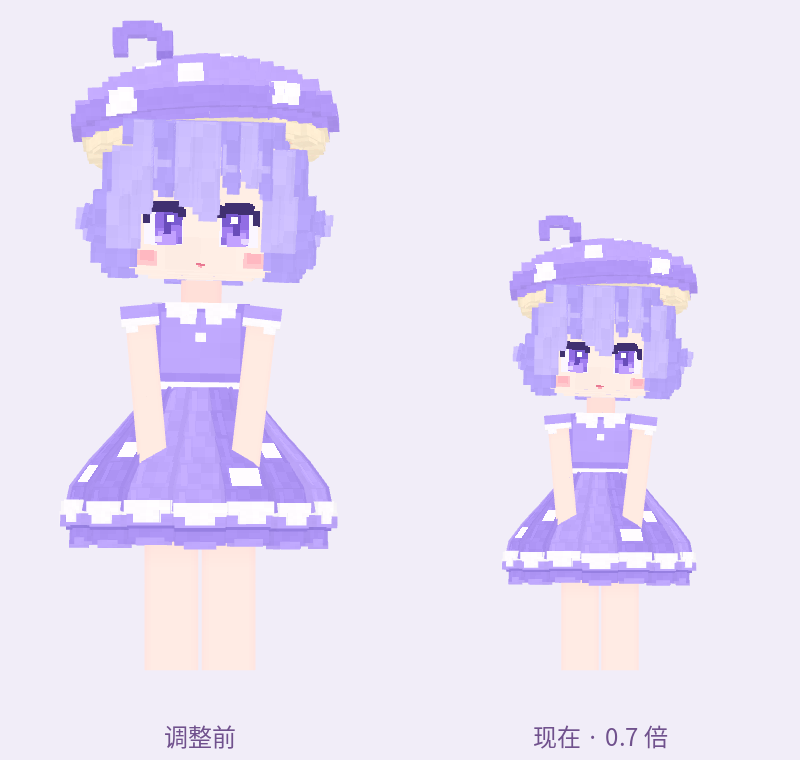
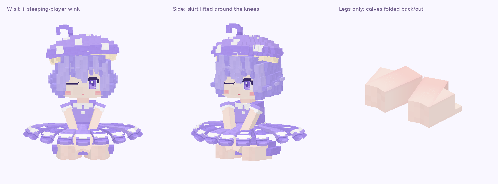
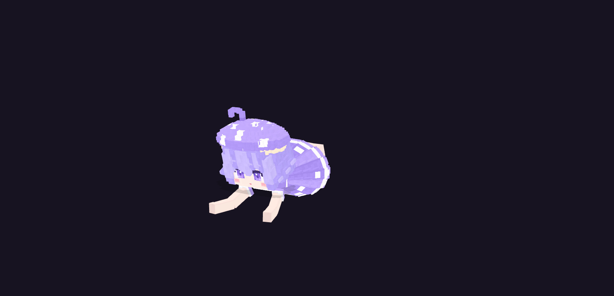
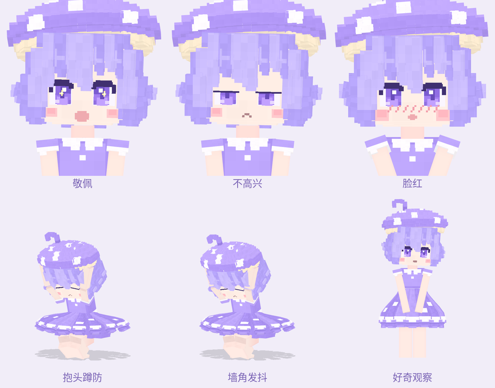

# 蘑菇娘 · 紫夜白与森林里的同伴

适用于本项目的 Minecraft 26.1.2、Fabric / NeoForge、GeckoLib 5.5.2。角色使用 `refer/purwhite/model/` 的第二版模型。参考工程保留原样；游戏中追加蜷缩休眠、困倦、哈欠和释放孢子的动画。

## 遇见她

蘑菇娘在蘑菇岛、黑森林、沼泽、红树林沼泽和繁茂洞穴低频生成，每组一个。紫夜白是名字之一，另有夜露紫、月霭白、暮雨铃、星苔眠、青露晚、紫霞霜、白雾谣、雨月堇、暮霜音。

当前默认暂时关闭蘑菇娘的消息，并将所有个体的名字固定为「紫夜白」。原台词、AI 聊天逻辑和随机名字仍保留，互动、关系增长与动作照常执行。原名随实体存档保存，解除固定后恢复；新生成与已有个体均应用开关，名字及昵称显示由服务端同步。僵尸（包括尸壳、溺尸和僵尸村民）会主动寻找可见的蘑菇娘，优先级高于主动攻击玩家；仍保留原版反击目标，僵尸猪灵保持原有中立行为。索敌范围、视线和目标有效性沿用原版。

这三项在 `config/toneko.json` 中独立控制：

```json
{
  "mushroom_girl.messages.enable": false,
  "mushroom_girl.fixed_name": true,
  "mushroom_girl.zombie_targeting": true
}
```

恢复发言时将 `mushroom_girl.messages.enable` 改为 `true`；恢复原名时将 `mushroom_girl.fixed_name` 改为 `false`；恢复原版僵尸索敌时将 `mushroom_girl.zombie_targeting` 改为 `false`。修改后执行 `/tonekoadmin reload config`，或重启游戏/服务器。解除索敌开关也会结束正在执行的蘑菇娘主动索敌目标；受到孢子攻击后的原版反击仍可能继续。

阴凉湿润的群系、水边和雨水有利于她恢复精神；干燥和日晒让她疲惫、行动变慢。她会寻找附近可到达的阴凉湿润位置。环境本身不会持续扣血。

体型统一缩为原模型的 0.7 倍，已生成的个体及幼体也适用；碰撞箱、视点、休眠菌盖和孢子释放高度同步缩放。成年清醒时碰撞箱约 0.63×1.54 格，休眠时约 0.63×0.315 格，幼体继续按成长比例缩放。



创造模式有专用刷怪蛋，也可以使用：

```mcfunction
/summon toneko:mushroom_girl
/give @s toneko:mushroom_girl_spawn_egg
/give @s toneko:coffee_beans 16
```

## 作息与互动

- 白天（时间 0–12999、23000–23999）蜷缩在贴地菌盖下，只露出菌盖。夜晚（13000–22999）自然醒来活动；洞穴内也按世界时间作息。
- 空手右键菌盖唤醒她；白天醒来后困倦、行动减慢，约两分钟后重新休眠。
- 喂一颗咖啡豆可保持精神五分钟。再次喂食刷新时长。危险、水中和跌落会打断休眠。
- 清醒时空手右键打开专属菜单；熟悉度达到 40 后，同时有摸菌盖的反应。可以通过菜单聊天、送礼。
- 蘑菇、蘑菇煲和苔藓也可以直接右键喂食。普通互动加 4 点熟悉度，普通食物加 12，咖啡加 15。
- 每位玩家独立积累熟悉度，范围 0–100；同一玩家每五秒最多计入一次正向互动。熟悉度达到 100 时开启好感度阶段，刚达到上限的那次互动不额外增加好感度。后续聊天、摸头、拥抱等有效互动增加 1 点好感度，普通食物增加 4，咖啡增加 5；好感度范围 0–100，独立保存并同步到客户端。受攻击时优先损失好感度，不足部分再降低熟悉度，伤害不会被正向互动冷却挡住。旧存档保留原熟悉度，好感度从 0 开始。
- 进入好感阶段后，菜单显示好感度与「亲近／亲密／依恋」阶段，50、80 分别进入后两阶段。好感度达到 20 后，清醒时会主动靠近十六格内喜欢的玩家，在约 2.5 格外陪伴。好感度 20 时一次停留约 20 秒、间隔约 50 秒；好感度 100 时一次约 60 秒、间隔约 10 秒。短暂被家具挡住视线不会立即结束已经开始的陪伴。停止跟随会暂停主动逗留一分钟，「停留」命令、白天休眠、危险与寻找合适环境仍受尊重；睡床陪伴会立即抢占这种日常逗留。
- 熟悉度 40 开放摸头，60 开放跟随与停留，80 开放潜行空手右键拥抱。菜单显示当前熟悉度和精神状态。
- 菜单里的「陪伴互动」：熟悉度 60 后可以站着直接背起她。地面坐/趴需要熟悉度 80，先用 `/neko lie` 躺下，也支持 `/neko getDown` 在陆地上趴下；原版床铺上的坐/趴需要熟悉度 60。菜单分别说明各动作条件。
- 熟悉度 60 的玩家睡在八格内的床上时，她会优先靠近，坐在玩家腿部并低头看向玩家；位置与朝向支持床的四个方向。黄昏玩家已能睡觉、她仍在白天休眠时，陪伴会唤醒她。此目标逐 tick 更新，在目标选择器及导航仲裁中均为最高优先级，可立即抢占其它行为，其它行为的停止导航请求也不能取消正在进行的床上靠近；仍遵守「停留」命令及危险中断。熟悉度 80 的玩家在六格内地面躺/趴时，她精神好会坐下，困倦会趴下。不会挤占已有乘客的玩家；主动让她下来后，同次躺卧最多一分钟内不再自动靠上来，仍可通过菜单再次邀请。玩家起身会清除本次下车的抑制，马上再次睡床也不会被旧冷却挡住；该冷却只针对被主动下车的玩家。
- 床上选人及靠近不要求全程直视玩家，可以绕过家具。寻路目标选择床尾与床侧可到达且能看见玩家的位置，避开直接走向被床占据的头部格子。坐上床采用与手动邀请相同的三格范围，允许从床尾邻格上床；实际坐上前仍检查视线、空位和安全状态。靠近后坐上失败会继续寻路，无法到达或十秒内未能坐上时让出控制权，五秒后重试。同为床上目标时会偏向好感度较高的玩家。
- 玩家在床上被她陪伴时，醒来会正常结束原版睡眠，但继续保留床上的躺卧位置与视角，直到按 Shift 或执行起身姿势命令。醒后第一人称仍绘制玩家的躺卧身体，起身后恢复普通第一人称规则。收到床上停留状态时客户端立即结束睡眠并清除睡眠遮罩计时，让原版睡眠界面正常关闭；快捷栏及 HUD 按玩家原有显示设置恢复。床上视角沿床的朝向，鼠标支持抬头、低头，视点不会随俯仰移动到床垫或身体内。相机朝向在裁剪范围生成前设置，转动鼠标不会让场景按错误朝向裁剪；致幻摇晃也在裁剪前应用。躺卧停留不参与跳过夜晚的睡眠人数判定；即使随后让她下来，也可继续躺着。床被破坏、入水、着火、死亡或成为乘客会结束停留，重新登录也不会保留旧钉定状态。
- 背起、坐下、趴下使用实际乘坐关系和独立姿势；乘客关系和动作数据会同步到承载玩家本人及旁观者客户端，结束时显式清除动作。普通地面躺卧的视点仍在玩家的脚部原点，因此坐姿前移 0.9 格、趴姿前移 1.45 格，并稍微偏向侧边，避免视点进入她的身体或菌盖；随玩家缩放，面向玩家视点。床上的座位仍按床朝向定位。背起随玩家移动及转向，碰撞箱随姿势调整。坐/趴时玩家主动起身会结束陪伴；入水、着火或她受伤也会结束。可以在菜单选择「让她下来」。
- 坐在玩家身上采用鸭子坐：双膝向前分开、小腿向后折到身体两侧、脚底平行于座面，裙摆随坐姿展开并抬起。背起时仍使用独立的腿部动作。
- Minecraft 26.1 的原版服务端骑乘流程拒绝玩家这种不能作为世界实体保存的载体。本功能只为已选定陪伴动作的蘑菇娘允许这类临时骑乘；乘坐期间她仍独立参与区块实体保存，重新载入后恢复自由活动。
- 停留仍遵守白天休眠、夜晚清醒的作息。受伤会醒来，并降低攻击者的熟悉度。

新增 51 条本地台词，无需配置 AI。附近有人时，约每 45–90 秒会打招呼、聊月色和雨水、嘟囔困意或寻找阴凉；唤醒、喂食、背起、陪伴、受伤和孢子成功生长也会触发对应台词。台词使用现有聊天栏/头顶气泡显示设置，并带说话嘴型。熟悉前含蓄，熟悉后会主动亲近，好感度较高时会表达想留在身边的意愿。AI 角色设定也包含各玩家独立的熟悉度与好感度。

自由聊天接入现有 AI 配置，启用 AI 后使用蘑菇娘专属角色设定。她没有猫娘的口癖，也不能产奶、与玩家或其他生物有性繁殖。

显式跟随时，好感度达到 20 后会在玩家附近等待，不会刚靠近就让出目标去随机游荡；仍可正常停止跟随、停留与邀请床上陪伴。

陪伴动作的独立模型预览（未放入玩家模型，贴合位置仍需游戏内检查）：


坐姿与 wink 的贴图几何预览，右侧单独显示腿部以检查折叠位置；不包含玩家与游戏光照：





## 面部表情

保留原模型的紫色大眼睛、深紫像素睫毛与方形高光。眼睛、嘴巴和腮红改为贴近皮肤的透明薄层，消除近看时的凸起与肤色方框；新增嘴型和闭眼纹理采用简洁的像素色块。

各嘴型在上一版基础上放大到 1.5 倍，重新绘制柔软的微笑、圆润张嘴和小小的撅嘴，保留原有开合动画。闭嘴只保留一条柔和的嘴缝，张嘴使用单一浅粉色口腔色块，不画边框，也不使用深色外圈、嘴唇或唇部高光。

待机时有轻微视线变化，视线也随看向玩家的动作移动。白天困倦时半睁眼、小嘴放松；喝咖啡或被熟悉的玩家摸菌盖时闭眼开心笑，打招呼时眨单眼，陌生互动与拥抱时害羞闭眼。害怕时闭眼抱头，打哈欠时嘴巴张开。显示实际 AI 回复时嘴型开合约 1.5–6 秒。脸部由独立控制器统一管理，眨眼不会覆盖互动表情。

她坐在正在睡觉的玩家身上时，循环单眼 wink，另一只眼保持睁开，嘴巴带轻微微笑；该状态优先于临时互动表情。玩家醒来后先恢复正常表情；如果还留在床上，连续看着她的脸超过 10 秒，她会脸红，菌盖上方冒少量向上飘的紫色蒸汽。看向别处会重置计时，红晕在移开视线约 3 秒后消退。睡眠、地面躺卧和单纯站在身边不会累计这段注视。

以下为模型预览，实际游戏光照需在客户端检查：


新增表情按敬佩、不高兴、脸红的参考图制作。敬佩时有金色星形眼神，不高兴时半眯眼并撅嘴，脸红时有斜线红晕。下图为实际游戏模型资源的预览，粒子需要在游戏内观察。



## 胆小与好奇

- 10 格内出现能看见的怪物，或被其他生物攻击时，她会停止活动、抱头蹲防。危险优先于跟随、停留、床上陪伴和闲逛；落水时仍优先浮起。
- 血量降到最大血量的 30% 或更低时，她寻找 8 格内可到达且没有暴露给已知威胁的位置，优先选择两面墙形成的墙角，避开水、岩浆块和营火。到达后蹲下发抖，回血到门槛以上后恢复活动；找不到可达掩体时会在原地蜷缩。
- 玩家消灭她刚才看见的威胁生物时，她朝玩家露出持续约 8 秒的敬佩表情，并增加关系进度。同一只生物只触发一次，投掷物击杀也可识别。若还有威胁，会先继续防御。
- 清醒、自由活动且没有危险时，她每隔约 30–60 秒尝试寻找附近的盔甲架或工作台、织布机、制图台、锻造台、切石机、附魔台，慢慢走近并左右观察约 4 秒。
- 对某位玩家的好感度大于 20 时，玩家在 12 格内且可见，清醒陪伴累计 5 分钟没有互动，她会露出不高兴的表情。玩家离线、远离、睡眠，以及她休眠或遇到危险时均不累计；聊天、摸头、送礼等互动会清除计时，即使这次关系增长还处于冷却中。计时随存档保存，不扣好感度。

## 孢子与致幻

清醒且没有坐在玩家身上时，菌盖附近会飘散孢子。每 30 秒释放一次生长孢子，搜索最多 16 处候选地面，每次释放只有一次 35% 的普通蘑菇概率判定。在阴凉湿润且普通蘑菇能存活的位置，实际放置红色或棕色蘑菇方块；附近 9×3×9 范围已有八朵蘑菇时停止新增。成功生长会在落点出现绿色粒子，她也会提醒附近玩家。

符合条件的成年个体每分钟有一次 0.1% 概率诞生新的蘑菇娘幼体，搜索多个落点不会放大这个概率。新成年个体不再先等待初始繁殖冷却；成功出生后母体冷却一个游戏日（24000 tick），幼体也有自己的冷却。出生需要阴凉湿润、可站立且无碰撞的地面，不再额外要求普通蘑菇在该光照下能存活；32 格内已有四个蘑菇娘时不再新增。幼体逐渐长大，有独立名字和熟悉度，不继承母体与玩家的关系。出生也有粒子和台词。关闭 `mob_griefing` 会关闭种蘑菇和孢子诞生幼体。

观察普通蘑菇可以在夜晚找树荫或洞穴，在她四格内放水，周围留出泥土/石头等完整方块上方的空气，避免明亮灯光。普通蘑菇仍遵守原版存活条件。幼体出生刻意非常罕见，几分钟没有出生属于正常情况。

防御孢子每 2 秒向当前威胁射出一发，有紫色轨迹、飞行时间和墙体碰撞，只命中指定威胁，不伤及旁观者。1 级时命中造成 3 点伤害（1.5 颗心），每级再增加 0.2 点，并施加 10 秒致幻，不再额外施加中毒。孢子在发射时记录伤害，飞行期间升级不会改变这发孢子的伤害，重新载入也保留该值。致幻降低移动速度和索敌范围，并扩大玩家、怪物发射普通箭矢与投掷物时的随机偏差。玩家还能看到淡紫雾感、漂浮蘑菇幻影和轻微相机摇晃；幻影只在客户端显示，不会产生真实方块或生物，牛奶可解除效果。

```mcfunction
/effect give @s toneko:hallucination 10 0
```

## 自然恢复与等级

蘑菇娘在阴凉处或夜晚每 30 秒自然恢复一次生命。阴凉沿用环境判定：当前位置亮度不高于 12，或天空被遮挡；夜晚为世界时间 13000–22999。1 级每次恢复 0.5 点，每级增加 0.1 点。受伤后暂停恢复 10 秒，再重新累计恢复间隔；着火和暴露在白天阳光下会重置间隔。恢复不会超过最大血量，也不再触发猫娘原有的无条件被动回血。

初始 1 级、最大 30 级。有效防御孢子命中怪物或正在攻击她的生物时获得 1 点经验，每 5 秒最多一次；射空、被免疫的伤害和攻击友方不计经验。熟悉度至少 60 的玩家在 6 格内且彼此可见、安全陪伴，每 30 秒获得 1 点经验，多位玩家不会叠加速度。玩家离开、视线中断、出现危险或着火会重置陪伴间隔。休眠和床上陪伴也可以累计；离线、区块未加载不会自动增长。

1→2 级需要 100 点经验，此后每级所需经验增加 40 点，因此只靠连续陪伴升到 2 级约需 50 分钟。每级增加 2 点最大血量、0.2 点孢子伤害和 0.1 点每次恢复量，升级不会立即补满新增血量。

| 等级 | 最大血量 | 孢子伤害 | 每 30 秒恢复 |
| --- | --- | --- | --- |
| 1 | 20 | 3 | 0.5 |
| 10 | 38 | 4.8 | 1.4 |
| 30 | 78 | 8.8 | 3.4 |

互动菜单显示等级、当前升级经验、血量与孢子伤害，满级时显示「已满级」。经验、恢复进度、受伤后的等待和陪伴进度随存档保存，属性同步到客户端；旧存档从 1 级开始，保留原有关系。

## 咖啡作物

森林与丛林的新生成区块中可找到野生咖啡植株，破坏后掉落 2–4 颗咖啡豆。咖啡豆可直接播种在耕地，作物有八个生长阶段，支持骨粉催熟；未成熟作物返还一颗豆，成熟作物额外掉落 2–4 颗，时运可增加产量。保留一颗即可重新播种。

咖啡豆识别使用 `toneko:coffee_beans` 和 `c:coffee_beans` 标签。数据包可向标签添加其他模组的咖啡豆；Herbal Brews 与 Farmer's Respite 的已知豆子 ID 以可选条目注册，无需强制安装。

## 资源与验证

```bash
python3 scripts/build_mushroom_assets.py
python3 scripts/verify_mushroom_assets.py
python3 scripts/preview_mushroom_reactions.py --capture
./gradlew :common:check :fabric:build :neoforge:build --offline
```

资源生成脚本会重建本功能的模型副本、动画、像素贴图、作物资源、战利品、标签和中英文本。预览脚本复用参考工程的 Three.js 工具，创建可切换动作和表情的 `build/mushroom-reactions/`；`--capture` 使用独立的无界面 Chrome 生成上方图片。资源检查验证脸部薄层、原眼睛保留、表情控制器、1.5 倍嘴巴、无红色嘴唇、蹲防脚底落地和双手位置。原有规则与陪伴检查之外，回归测试覆盖主动防御、安全墙角、救援归因、冷落计时保存、醒来后的连续注视、四个方向的床上视角和实际 Projectile mixin 的命中偏差。成长检查执行正式的恢复计时、经验记账、真实孢子命中和存档编解码，覆盖白天阴凉、日晒、夜晚、着火、受伤等待、升级门槛、属性不叠加、恢复上限、陪伴范围与熟悉度、战斗经验冷却、免疫伤害以及旧存档与异常经验值。

`mushroomNativeRegressionTest` 使用当前 Minecraft 的真实 `EntityReference` 复现旧代码的 UUID-null 引用崩溃，并调用实际伤害归属覆盖方法验证修复、陌生玩家归属、原版乘坐位置计算、玩家缩放、陪伴碰撞箱和躺卧姿势判定。还直接检查向承载玩家本人发送的原版元数据/乘客包顺序，并用当前版本的网络编解码器验证动作同步和下车时的显式清除。仅用构造器外的实体夹具调用这些方法，不在世界中 tick 夹具。

`mushroomBedRestRegressionTest` 在原版 `Player.stopSleepInBed` 前后执行正式的床上停留钩子，验证睡眠状态正常结束、醒后保留位置/朝向/躺姿、四个床朝向的腿部座位位置、移动与重力漂移修正、主动起身清除，以及陌生玩家/背起/主动起身/无乘客时不保留躺姿。夹具不启动客户端或模组加载器。

`mushroomCompanionRegressionTest` 通过 Fabric 的真实 Knot/Mixin 加载器加载正式的骑乘修复，直接调用 Minecraft 服务端的 `startRiding`，验证三种陪伴模式能建立实际双向乘客关系，无陪伴动作时仍遵守原版限制，以及乘坐期间的独立保存入口。再执行正式自动陪伴目标的选人、靠近和坐上流程，覆盖四种床朝向、精神/困倦两种状态、熟悉度边界、自动坐上后的本人同步与目标结束，以及陪伴目标优先级。测试使用隔离世界夹具和导航记录器，不启动游戏世界；寻路可达性和客户端画面仍需游戏内检查。原版位置回归检查也覆盖三个玩家缩放比例与四个朝向下的地面视点间距。

该陪伴回归还执行原版 `GoalSelector` 的抢占流程和 `NekoBrain` 的完整导航仲裁，检查黄昏休眠中断、八格内选人、床铺优先于较近的地面躺卧、逐 tick 靠近，以及主动下车与自然起身的不同冷却。最高优先级检查覆盖全部其它导航层级的立即抢占、防止反向抢占和其它行为停止请求，并检查所有注册目标的优先级均低于陪伴。

该回归还使用原版方块碰撞射线验证床边候选位置，检查临时丢失视线、近距离坐上失败后继续寻路、床尾邻格坐上、不可达路径让出控制权与重试、主动下车后起身清除冷却。寻路可达结果由导航夹具控制，实际地图上的完整寻路仍需游戏内检查。关系测试执行正式的互动记账、原版存储编解码、同步字符串和旧存档加载，检查玩家独立记录、好感阶段门槛、互动冷却、伤害扣分和主动逗留；原版目标选择器也验证睡床陪伴会抢占正在进行的好感逗留。

`mushroomClientRegressionTest` 使用真实 Fabric 客户端 Mixin 变换器，验证相机、身体可见性与醒来包注入能加载。在无 GPU 的客户端夹具中执行原版相机对齐、视图矩阵和裁剪范围生成，覆盖四种床朝向、六种鼠标朝向与五种俯仰，确认视线前方可见、后方被裁剪、上下转头不移动床上视点、醒后相机状态不再标记睡眠、睡眠遮罩计时清零，以及主动起身恢复普通视角。执行原版 `LevelRenderer` 的第一人称实体筛选，检查原版睡眠与醒后停留都保留身体绘制，起身后恢复普通筛选；并检查坐姿 wink 在玩家醒来时结束，背起与趴姿不会触发。还执行正式 Gecko 渲染姿态和骨骼变换，检查乘客不会继承错误的玩家身体朝向，头部和眼睛实际朝下。该检查不绘制完整 HUD，也不代替游戏内画面实测。

`mushroomSporeRegressionTest` 直接调用正式的孢子释放代码，使用可控世界夹具和原版蘑菇方块验证真实方块放置、多落点搜索、单次概率判定、粒子、幼体创建与冷却、数量限制、碰撞限制，以及休眠/乘坐/关闭 mob_griefing 的限制。测试中的出生概率可控，不改变正式游戏的稀有概率。

`coffeeWorldgenCodecTest` 使用目标 Minecraft 版本的实际解码器解析咖啡的 configured / placed feature，并检查注册表引用绑定。测试不启动世界或模组加载器，因此以原版蘑菇替代已冻结方块注册表中尚未注册的咖啡方块。26.1 已移除 `minecraft:random_patch`，咖啡使用 `minecraft:simple_block`，由 placed feature 的 `count` 和 `random_offset` 完成每片 12 次的散布。

模型已通过本地 WebGL 预览检查。专用服务端启动验证另受当前项目的开发运行环境影响：Fabric 的 Loom 缓存依赖存在 `named` / `official` 命名空间不匹配，NeoForge 的现有炼药锅初始化在物品组件绑定前构造 `ItemStack`。这两项可能阻止完整游戏启动；编译成功不能代替客户端画面与双玩家联机实测。

建议游戏内继续检查：白天菌盖碰撞与唤醒、五分钟咖啡结束后的休眠、夜晚清醒、两位玩家不同熟悉度、站立背起后转向与下车、承载玩家本人和旁观者看到同一坐/趴动作、床上自动腿部陪伴、醒来保留床上视角及 Shift 起身、四向床铺上的贴合位置、断线和存档重载、对攻击者的致幻效果、牛奶解除、耕作循环，以及 `/reload` 后的咖啡世界生成资源。客户端和服务端应一并替换新模组包。模型预览和夹具检查不代替客户端与双玩家联机实测。
